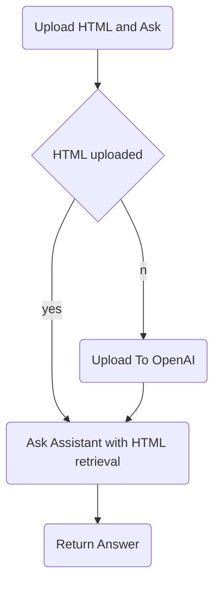

# Web  Q&A with Embeddings

Learn how to crawl your website and build a Q/A bot with the OpenAI API. You can find the full tutorial in the [OpenAI documentation](https://platform.openai.com/docs/tutorials/web-qa-embeddings).

## To run the server:

```
python -m venv venv
pip install -r requirements.txt
python app.py
```

## Flowchart of Design



## API Reference

| PATH                      | METHOD   | PARAMS                                                       | HEADER  | BODY                 | RESPONSE                                                     |
| ------------------------- | -------- | ------------------------------------------------------------ | ------- | -------------------- | ------------------------------------------------------------ |
| /web_qa                   | GET      | question(str): question to ask about the site<br />url(str): url of the page to ask, e.g. https://platform.openai.com/docs/api-reference/messages/getMessage | --      | --                   | {<br />    "answer":"",<br />    "basis":["keyword", "or sentence"]<br />} |
| /suggestion               | GET      | url(str): url of the page to ask, e.g. https://platform.openai.com/docs/api-reference/messages/getMessage | --      | --                   | {<br />    "questions":["question1","question2"]<br />}      |
| /upload                   | POST     | url(str): url of the page to ask, e.g. https://platform.openai.com/docs/api-reference/messages/getMessage | --      | {"html":html string} | { "status": "success" }                                      |
| **/assistant_qa**         | **SAME** | **TO**                                                       | **THE** | **WEB_QA**           |                                                              |
| **/assistant_suggestion** | **SAME** | **TO**                                                       | **THE** | **SUGGESTION**       |                                                              |

